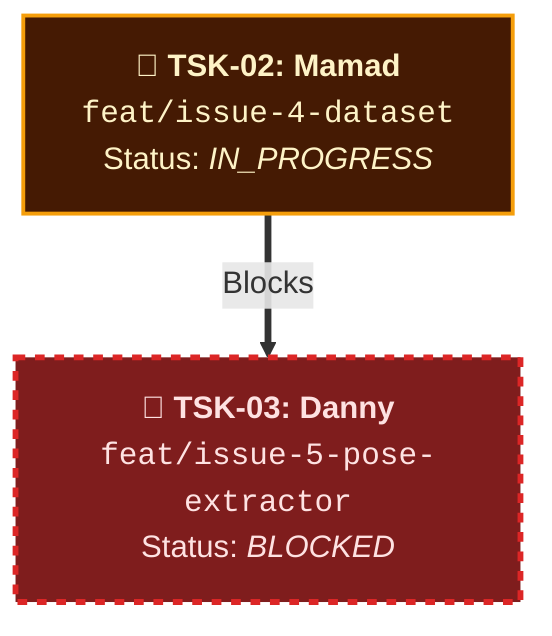

# Sprint 01: Team Workflow & Dependency Map

> **Internal Tool Notice:** Generated automatically by `src/internal_tools/workflow_agent.py`.

```mermaid
graph TD
    %% Global Node Styles
    classDef style_Mehrnaz fill:#2E1065,stroke:#A78BFA,stroke-width:2px,color:#EDE9FE;
    classDef style_Mamad fill:#451A03,stroke:#F59E0B,stroke-width:2px,color:#FEF3C7;
    classDef style_Danny fill:#172554,stroke:#3B82F6,stroke-width:2px,color:#DBEAFE;
    classDef style_Kamran fill:#022C22,stroke:#10B981,stroke-width:2px,color:#D1FAE5;
    classDef style_Hessam fill:#500724,stroke:#EC4899,stroke-width:2px,color:#FCE7F3;
    classDef style_Arash fill:#083344,stroke:#06B6D4,stroke-width:2px,color:#CFFAFE;
    classDef style_Ramin fill:#450A0A,stroke:#EF4444,stroke-width:2px,color:#FEE2E2;
    classDef blockedNode fill:#7F1D1D,stroke:#DC2626,stroke-width:3px,color:#FEE2E2,stroke-dasharray: 5 5;

    %% Tasks & Active Branches
    TSK_02["🔄 <b>TSK-02: Mamad</b><br/><code>feat/issue-4-dataset</code><br/>Status: <i>IN_PROGRESS</i>"]
    TSK_03["🚫 <b>TSK-03: Danny</b><br/><code>feat/issue-5-pose-extractor</code><br/>Status: <i>BLOCKED</i>"]

    %% Task Dependencies
    TSK_02 ==>|Blocks| TSK_03

    %% Apply Member Colors
    class TSK_02 style_Mamad;
    class TSK_03 blockedNode;
```
