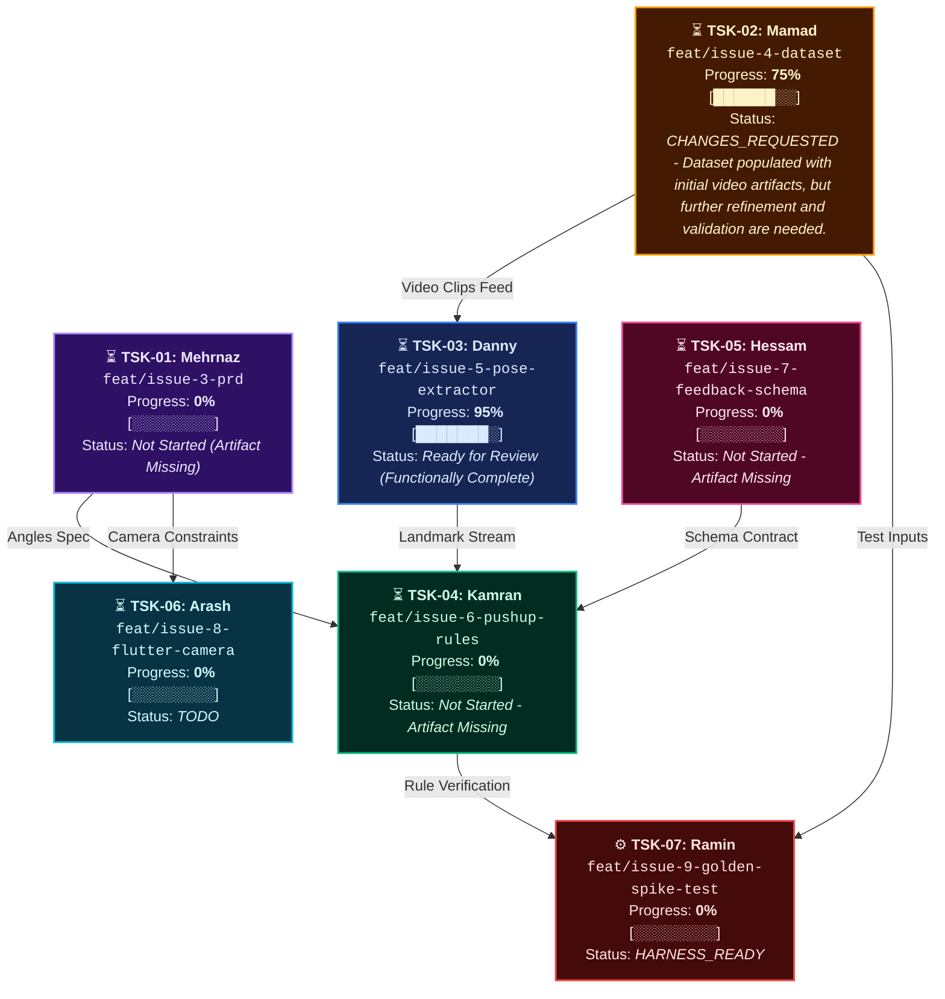

# Sprint 01: Automated Live Workflow & Dependency Engine

> **Notice:** Generated dynamically via AI code audits against `sprint_01.yaml`.

```mermaid
graph TD
    %% Styles
    classDef style_Mehrnaz fill:#2E1065,stroke:#A78BFA,stroke-width:2px,color:#EDE9FE;
    classDef style_Mamad fill:#451A03,stroke:#F59E0B,stroke-width:2px,color:#FEF3C7;
    classDef style_Danny fill:#172554,stroke:#3B82F6,stroke-width:2px,color:#DBEAFE;
    classDef style_Kamran fill:#022C22,stroke:#10B981,stroke-width:2px,color:#D1FAE5;
    classDef style_Hessam fill:#500724,stroke:#EC4899,stroke-width:2px,color:#FCE7F3;
    classDef style_Arash fill:#083344,stroke:#06B6D4,stroke-width:2px,color:#CFFAFE;
    classDef style_Ramin fill:#450A0A,stroke:#EF4444,stroke-width:2px,color:#FEE2E2;
    classDef blockedNode fill:#7F1D1D,stroke:#DC2626,stroke-width:3px,color:#FEE2E2,stroke-dasharray: 5 5;
    classDef verifiedNode fill:#064E3B,stroke:#059669,stroke-width:3px,color:#ECFDF5;

    %% Tasks
    TSK_01["⏳ <b>TSK-01: Mehrnaz</b><br/><code>feat/issue-3-prd</code><br/>Progress: <b>0%</b> [░░░░░░░░]<br/>Status: <i>Not Started (Artifact Missing)</i>"]
    TSK_02["⏳ <b>TSK-02: Mamad</b><br/><code>feat/issue-4-dataset</code><br/>Progress: <b>75%</b> [██████░░]<br/>Status: <i>CHANGES_REQUESTED - Dataset populated with initial video artifacts, but further refinement and validation are needed.</i>"]
    TSK_03["⏳ <b>TSK-03: Danny</b><br/><code>feat/issue-5-pose-extractor</code><br/>Progress: <b>95%</b> [███████░]<br/>Status: <i>Ready for Review (Functionally Complete)</i>"]
    TSK_04["⏳ <b>TSK-04: Kamran</b><br/><code>feat/issue-6-pushup-rules</code><br/>Progress: <b>0%</b> [░░░░░░░░]<br/>Status: <i>Not Started - Artifact Missing</i>"]
    TSK_05["⏳ <b>TSK-05: Hessam</b><br/><code>feat/issue-7-feedback-schema</code><br/>Progress: <b>0%</b> [░░░░░░░░]<br/>Status: <i>Not Started - Artifact Missing</i>"]
    TSK_06["⏳ <b>TSK-06: Arash</b><br/><code>feat/issue-8-flutter-camera</code><br/>Progress: <b>0%</b> [░░░░░░░░]<br/>Status: <i>TODO</i>"]
    TSK_07["⚙️ <b>TSK-07: Ramin</b><br/><code>feat/issue-9-golden-spike-test</code><br/>Progress: <b>0%</b> [░░░░░░░░]<br/>Status: <i>HARNESS_READY</i>"]

    %% Pipeline Sequence
    TSK_01 -->|Angles Spec| TSK_04
    TSK_01 -->|Camera Constraints| TSK_06
    TSK_02 -->|Video Clips Feed| TSK_03
    TSK_03 -->|Landmark Stream| TSK_04
    TSK_05 -->|Schema Contract| TSK_04
    TSK_04 -->|Rule Verification| TSK_07
    TSK_02 -->|Test Inputs| TSK_07

    %% Classes
    class TSK_01 style_Mehrnaz;
    class TSK_02 style_Mamad;
    class TSK_03 style_Danny;
    class TSK_04 style_Kamran;
    class TSK_05 style_Hessam;
    class TSK_06 style_Arash;
    class TSK_07 style_Ramin;
```
